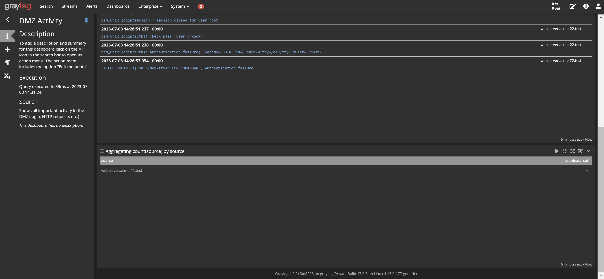
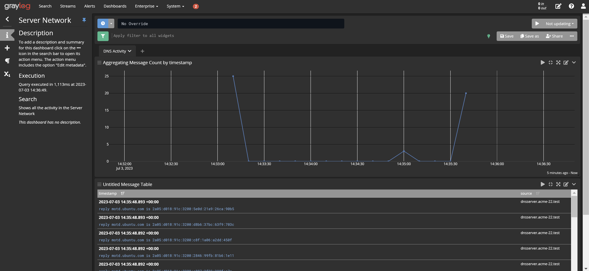
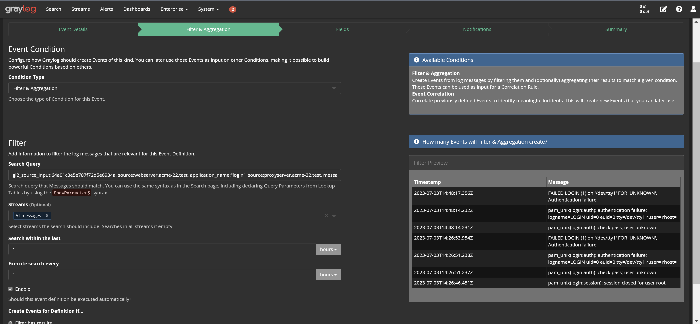

# Graylog Server Configuration
For receving the logs we created Syslog UDP input with 6 agents on port 9000, configuration of the input is shown below 

**Internal Client Network**
```
allow_override_date: true
bind_address: 0.0.0.0
expand_structured_data: false
force_rdns: false
number_worker_threads: 2
override_source: <empty>
port: 9000
recv_buffer_size: 262144
store_full_message: false
```

Once we configured the clients and the server we immideately started to receive logs from the clients. Some of the logs received are shown below in the CSV format that we obtained from the Graylog dashboard

```
"2023-07-01T15:05:01.000Z","kali","kali CRON[34694]: pam_unix(cron:session): session closed for user root"
"2023-07-01T15:05:01.000Z","kali","kali CRON[34699]: (root) CMD (command -v debian-sa1 > /dev/null && debian-sa1 1 1)"
"2023-07-01T15:05:01.000Z","kali","kali CRON[34694]: pam_unix(cron:session): session opened for user root(uid=0) by (uid=0)"
"2023-07-01T15:09:01.000Z","kali","kali systemd[1]: Finished Clean php session files."
"2023-07-01T15:09:01.000Z","kali","kali systemd[1]: phpsessionclean.service: Deactivated successfully."
"2023-07-01T15:09:01.000Z","kali","kali systemd[1]: Starting Clean php session files..."
"2023-07-01T15:09:01.000Z","kali","kali CRON[35658]: pam_unix(cron:session): session closed for user root"
"2023-07-01T15:09:01.000Z","kali","kali CRON[35659]: (root) CMD (  [ -x /usr/lib/php/sessionclean ] && if [ ! -d /run/systemd/system ]; then /usr/lib/php/sessionclean; fi)"
"2023-07-01T15:09:01.000Z","kali","kali CRON[35658]: pam_unix(cron:session): session opened for user root(uid=0) by (uid=0)"
"2023-07-01T15:10:37.000Z","kali","kali spice-vdagentd: closed vdagent virtio channel"
"2023-07-01T15:10:37.000Z","kali","kali spice-vdagentd: Error getting active session: No data available"
"2023-07-01T15:10:37.000Z","kali","kali spice-vdagentd: Error getting active session: No data available"
```

# Client Configuration 
Once the the server is set we proceed to configure the necessary client, for testing if we receive logs or not. We configured Kali machine with the IP address `100.100.2.100` on Clients Network as follows. Configurations are located in the same directory for all the clients which is `/etc/rsyslog.d/graylog.conf` 


```
$PreserveFQDN on
*.* @100.100.1.10:9000;RSYSLOG_SyslogProtocol23Format
```

# Dashboard Configuration
Once we configured all the necessary clients and the server, we proceed to create a meaningful dashboard for the ACME network. We aim to create dashboards that will tell us if something going on wrong in the network and is there any system failures. Below are the dashboards and pages with graphs and tables included in them

## DMZ Activity
This dashboard shows specifically failed authentication on DMZ, we included possible actions. For monitoring log in acitivity we created the below page


For capturing the login activities in DMZ, in the message table we configured to query with the following command

```
gl2_source_input:64a01c3e5e787f72d5e6934a, source:webserver.acme-22.test, application_name:"login", source:proxyserver.acme-22.test
``` 
And as can be seen from the figure we have two different aggregation widget message count and bar plot that shows the number of failed log in attempts. And there is a table that shows number of failed login attempts for specific users, such as for web-proxy we generated a failed login attempt and on the table it shows accordingly. To detect such cases we used the below query which filters out the messages that includes "authentication failure" string 
```
gl2_source_input:64a01c3e5e787f72d5e6934a, source:webserver.acme-22.test, application_name:"login", source:proxyserver.acme-22.test, message:"authentication failure"
```
And furthermore on the below figure you can see the table specifically configured to see who have failed login attempts and how many failed login attempts etc.

## Server Network Activity
For this part we mainly focused on the DNS activity, beforehand we installed `dnsmasq` and configured enable logging opetions which are `log-queries` and `log-dhcp`. Once we enabled these options we observed that logs are being generated on the Graylog side. For PoC we run `nslookup www.chess.com` to trigger some DNS queries
```
root@dnsserver:~# nslookup www.chess.com
Server:         151.100.4.2
Address:        151.100.4.2#53

Non-authoritative answer:
www.chess.com   canonical name = www.chess.com.cdn.cloudflare.net.
Name:   www.chess.com.cdn.cloudflare.net
Address: 104.17.81.122
Name:   www.chess.com.cdn.cloudflare.net
Address: 104.17.78.122
Name:   www.chess.com.cdn.cloudflare.net
Address: 104.17.79.122
Name:   www.chess.com.cdn.cloudflare.net
Address: 104.17.80.122
Name:   www.chess.com.cdn.cloudflare.net
Address: 104.17.77.122

root@dnsserver:~# 
```
Then, on the graylog side we can see the line chart and the message table is updated accordingly. Reasons we choose the line chart is it can show us more clear picture of the DNS noise, spikes, requests in the network more meaningfully, compare to bar plot 


# Notification Configuration
For this part of the assignment we focused on failed login attempts on DMZ part of the network, we set up an alert as shown below with the query menitoned in the previous section.

